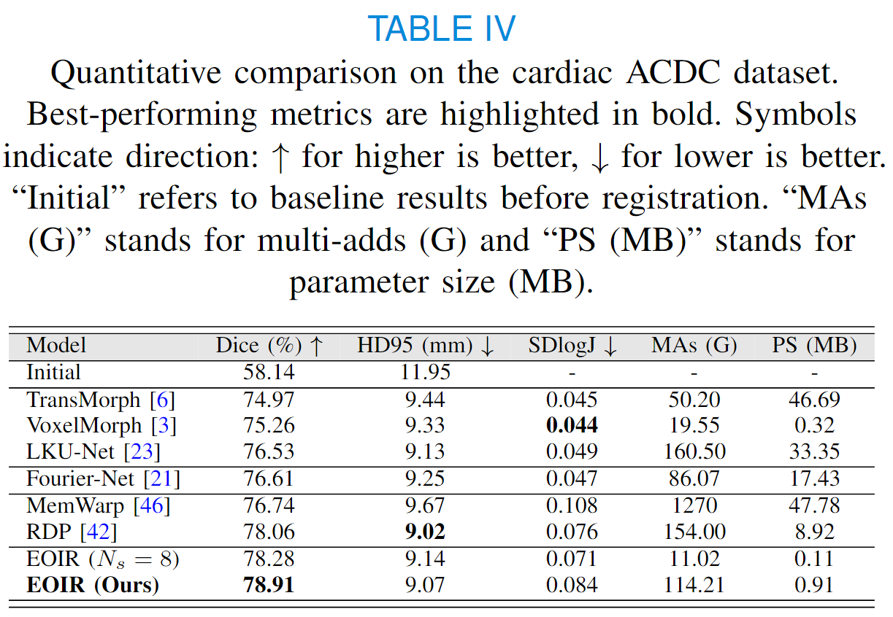

# EOIR: Encoder-only Image Registration


 <a href="https://opensource.org/licenses/MIT"></a> [](https://arxiv.org/abs/2509.00451)

This repository hosts the official PyTorch implementation of "Encoder-Only Image Registration". EOIR is an efficient backbone network for image registration. It can achieve state-of-the-art registration performance on various registration tasks while keeping a relatively low number of registration parameters. We have demonstrated its efficacy in weakly-supervised and unsupervised inter-subject brain image registration, weakly-supervised inter-subject abdomen image registration and unsupervised intra-subject cardiac image registration.

<p align="center">
    
</p>

## Papers

**[Encoder-Only Image Registration](https://arxiv.org/abs/2509.00451)** <br>
[Xiang Chen](https://grzy.hnu.edu.cn/site/index/chenxiang), Renjiu Hu, Min Liu, Yuxi Zhang, Yaonan Wang and [Hang Zhang](https://tinymilky.com). <br>
arXiv 2024.


## Highlights

- The EOIR ranks **2nd** on the validation set of task 2 in [MICCAI 2024 Learn2Reg Challenge](https://learn2reg.grand-challenge.org/) (details can be found in '\LUMIR').
<p align="center">
    
</p>

- The EOIR achieves state-of-the-art registration performance with only limited registration parameters on four different datasets.
<p align="center">
    
</p>
<p align="center">
    
</p>
<p align="center">
    
</p>
<p align="center">
    
</p>

- EOIR is a novel efficient backbone network for image registration, which can be incorporated with more complex structures like large kernel ([LKU-Net](https://github.com/xi-jia/LKU-Net)), co-attention, and transformer ([TransMorph](https://github.com/junyuchen245/TransMorph_Transformer_for_Medical_Image_Registration)) to achieve better registration performance.  


## Datasets

We evaluate the registration performance of EOIR on four different datasets, including [LUMIR](https://drive.google.com/uc?export=download&id=1PTHAX9hZX7HBXXUGVvI1ar1LUf4aVbq9), [OASIS](https://learn2reg.grand-challenge.org/Learn2Reg2021/), [Abdomen CT](https://drive.usercontent.google.com/download?id=1aWyS_mQ5n7X2bTk9etHrn5di2-EZEzyO&export=download&authuser=0) and [ACDC](https://www.creatis.insa-lyon.fr/Challenge/acdc/databases.html).

## Usage
Run the script with the following command in folder `./src` to reproduce the results:
```
python train_registration.py -m EOIR -d abdomenreg -bs 1 --num_classes 14 start_channel=32 --gpu_id 0
python train_registration.py -m EOIR_OASIS -d oasisreg -bs 1 --num_classes 36 start_channel=32 --gpu_id 0
python train_registration_ACDC.py -m EOIR_ACDC -d acdcreg -bs 1 --num_classes 4 start_channel=32 --gpu_id 0
python train_registration_LUMIR.py --model EOIR -d lumirreg -bs 1 start_channel=32 --gpu_id 0 
```

- `-d abdomenreg`: Dataset used, specifically 'abdomenreg'.
- `-m EOIR`: Model name, set to 'EOIR'.
- `-bs 1`: Batch size, defined as 1.
- `start_channel=32`: Number of starting channels (`N_s`), set to 32.


To test the trained model, run the script with the following command in folder `./src` to get the npz files:
```
python test_registration_abdomen.py -m EOIR -d abdomenreg -bs 1 start_channel=32 --gpu_id 0
python test_registration_OASIS.py -m EOIR_OASIS -d oasisreg -bs 1 start_channel=32 --gpu_id 0
python test_registration_ACDC.py -m EOIR_ACDC -d acdcreg -bs 1 start_channel=32 --gpu_id 0 
python test_registration_LUMIR.py -m EOIR -d lumirreg -bs 1 start_channel=32 --gpu_id 0 
```
- `-d abdomenreg`: Dataset used, specifically 'abdomenreg'.
- `-m EOIR`: Model name, set to 'EOIR'.
- `-bs 1`: Batch size, defined as 1.
- `start_channel=32`: Number of starting channels (`N_s`), set to 32.


## Citation
If our work has influenced or contributed to your research, please kindly acknowledge it by citing:
```
@article{chen2024encoder,
  title={Encoder-Only Image Registration},
  author={Chen, Xiang and Hu, Renjiu, and Liu, Min and Zhang, Yuxi and Wang Yaonan and Zhang, Hang},
  journal={},
  year={2024},
  publisher={IEEE}
}


```

## Acknowledgment

We extend our gratitude to [textSCF](https://github.com/tinymilky/TextSCF/tree/main), [LKU-Net](https://github.com/xi-jia/LKU-Net), [LapRIN](https://github.com/cwmok/LapIRN), [VoxelMorph](https://github.com/voxelmorph/voxelmorph), and [TransMorph](https://github.com/junyuchen245/TransMorph_Transformer_for_Medical_Image_Registration) for their valuable contributions. Portions of the code in this repository have been adapted from these sources.

###### Keywords
Keywords: Image registration, large deformation, Convolutional neural networks
